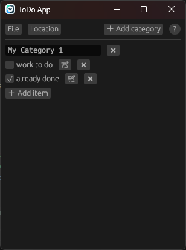

[](https://github.com/bircni/todo-egui/actions/workflows/ci.yml)

# todo-egui

A simple todo app built with Rust and egui.



## Development

Build and run the app:

```bash
cargo run --release
```
